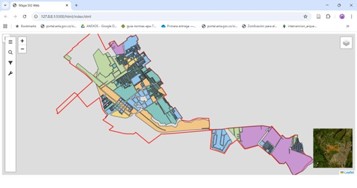
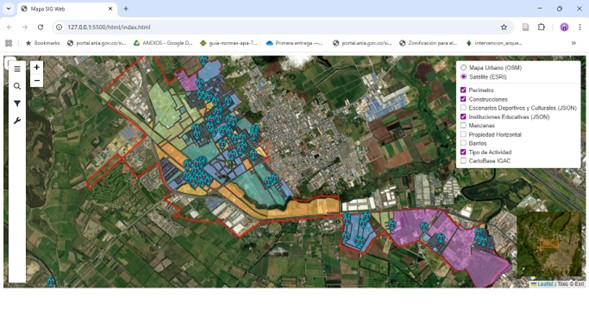

# GeoUrbis: Visor Geográfico Interactivo para la Gestión y Análisis Urbano en Mosquera, Cundinamarca

## 1. Descripción General del Proyecto

**GeoUrbis** es un visor geográfico interactivo diseñado para facilitar la visualización, consulta y análisis de información urbana del municipio de Mosquera, Cundinamarca. Su propósito es presentar datos espaciales relevantes de manera accesible y comprensible para ciudadanos y profesionales, promoviendo la toma de decisiones informadas sobre desarrollo urbano y uso del suelo.

El sistema integra datos espaciales almacenados en **PostgreSQL/PostGIS**, publicados por **GeoServer** mediante servicios estándar OGC (WMS/WFS), y consumidos por una aplicación web desarrollada con **Leaflet**. GeoUrbis provee herramientas de búsqueda, filtrado, medidas y dibujo, así como un panel lateral que facilita la interacción con múltiples capas temáticas.

## 2. Objetivos del Proyecto

### Objetivo General
Desarrollar un visor geográfico interactivo que permita la consulta y análisis de información urbana del municipio de Mosquera, facilitando la visualización y el acceso a datos espaciales para distintos tipos de usuarios.

### Objetivos Específicos
- Integrar datos espaciales almacenados en PostGIS y publicados mediante GeoServer.
- Implementar funcionalidades de búsqueda y filtrado por atributos (ej. búsqueda de manzanas y construcciones por código).
- Añadir herramientas de medición (distancia y área) y dibujo sobre el mapa para un análisis exploratorio.
- Diseñar una interfaz intuitiva y responsiva que apoye la consulta para ciudadanos y profesionales.

## 3. Audiencia Objetivo

GeoUrbis está pensado para:
- Ciudadanos que desean consultar información geográfica sobre Mosquera.
- Planificadores urbanos e ingenieros involucrados en proyectos municipales.
- Empleados del sector público que necesiten una herramienta ligera para análisis y toma de decisiones.

---

## 4. Funcionalidades Principales - Capturas de Pantalla
Esta es una visualización del inicio del geovisor


GeoUrbis integra las siguientes funcionalidades destacadas:

- **Visualización de Capas Temáticas:** Se muestran las capas cargadas en el visor geográfico: manzanas, construcciones, barrios, equipamientos como instituciones educativas y escenarios deportivos y culturales, perímetro urbano, áreas de actividad urbanas establecidas en el POT y cartografía básica oficial del IGAC como vías y drenajes. Las capas se consumen vía WMS/WFS desde GeoServer y se puede activar o desactivar su visualización.


- **Mapas Base:** Este geovisor cuenta con el despliegue de dos mapas base, un mapa urbano correspondiente a OpenStreetMap y un mapa satelital perteneciente a ESRI.

- **Zoom:** Herramienta para acercarse o alejarse de la extensión actual del mapa.

- **Búsqueda por Código:** Permite buscar manzanas o construcciones mediante su código único (consulta WFS con `CQL_FILTER`).


- **Filtrado Dinámico:** Esta herramienta permite construir filtros por barrio o tipo de actividad que permiten explorar subconjuntos de datos.

- **Popups Informativos:** Ventanas emergentes muestran atributos relevantes al hacer click sobre una entidad.

- **Medición y Dibujo:** Herramientas para medir distancias y áreas, y dibujar geometrías temporales en el mapa (Leaflet Draw).

- **MiniMapa:** Mini mapa de contexto.

- **Panel Lateral (Sidebar):** Organización de herramientas, búsquedas y filtros en una interfaz lateral accesible.

---

## 7. Fuentes de Datos

- **Base de datos:** PostgreSQL con extensión PostGIS; contiene las tablas espaciales con geometrías y atributos del municipio.
- **Servidor de publicación:** GeoServer, que expone servicios WMS y WFS para las capas almacenadas en PostGIS.
- **Capas base externas:** Servicios WMS oficiales del IGAC (cartografía base, vías, drenajes) para referencia cartográfica.

---

## 8. Arquitectura y Flujo de Datos

1. **Datos originales** → cargados y mantenidos en PostgreSQL/PostGIS.
2. **GeoServer** → publica capas como WMS/WFS; aplica estilos SLD para simbolización.
3. **Frontend (Leaflet)** → consume WMS para visualización raster y WFS (GeoJSON) para búsquedas y filtros.
4. **Interacción del usuario** → acciones (búsqueda, clic, dibujo) desencadenan peticiones fetch() al servidor GeoServer o manipulación local de capas.

---

## 9. Librerías y Servicios Utilizados

### Frontend
- **Leaflet** — biblioteca principal de mapas (visualización, interacción).
- **Leaflet Draw** — herramientas de dibujo y medición.
- **Leaflet Sidebar** — panel lateral para herramientas y filtros.
- **Leaflet MiniMap** — mini mapa de contexto.
- **Font Awesome** — iconografía en la interfaz.
- **Otras utilidades JS** (e.g., L.GeometryUtil).

### Backend SIG
- **PostgreSQL** — sistema gestor de base de datos relacional.
- **PostGIS** — extensión espacial para PostgreSQL.
- **GeoServer** — servidor de mapas para publicar WMS/WFS y gestionar SLD.

### Servicios OGC
- **WMS (Web Map Service)** — para renderización de mapas.
- **WFS (Web Feature Service)** — para obtener entidades vectoriales (GeoJSON) y realizar consultas dinámicas.

---

## 10. Elección de la Biblioteca de Mapas (Choice of Mapping Library)

En GeoUrbis se eligió **Leaflet** como biblioteca de mapas por las siguientes razones:

- **Ligereza y rendimiento:** Leaflet es una de las bibliotecas más ligeras disponibles, favoreciendo tiempos de carga rápidos.
- **Simplicidad de uso:** API clara y documentación extensa; acelera el desarrollo y prototipado.
- **Ecosistema de plugins:** existen múltiples plugins listos para usar (Draw, Sidebar, MiniMap), lo que reduce trabajo de implementación.
- **Compatibilidad con GeoServer:** consumo directo de WMS/WFS sin configuraciones complejas.
- **Adecuado al alcance:** para un visorde consulta urbana (no necesariamente renderizado vectorial complejo) Leaflet ofrece el equilibrio óptimo entre funcionalidad y complejidad.

**Comparación breve:**
- *OpenLayers* ofrece mayor potencia para operaciones complejas y manejo nativo de proyecciones y fuentes, pero añade mayor complejidad y tamaño.
- *MapLibre* (o Mapbox GL JS) es excelente para mapas vectoriales y renderizado por GPU, pero requiere infraestructura adicional de vector tiles o un flujo distinto de datos.

---

## 11. Agradecimientos y Herramientas Asistidas por IA

Agradecimientos a la comunidad geoespacial por las librerías open source: **Leaflet**, **GeoServer**, **PostGIS** y a los proveedores de datos cartográficos oficiales (IGAC).

### Declaración sobre uso de IA
Durante la elaboración de la documentación y apoyo conceptual, se utilizó asistencia de herramientas de IA (por ejemplo, ChatGPT de OpenAI) para generar y pulir textos de la documentación. Cualquier parte del contenido generada con asistencia de IA ha sido revisada y adaptada manualmente por el equipo desarrollador.

---

# Guía de Instalación y Despliegue de la Aplicación GeoUrbis
## 1. Requisitos Previos
Antes de ejecutar la aplicación, instalar:

### PostgreSQL + PostGIS
https://www.postgresql.org/download  
https://postgis.net/install/

### GeoServer
https://geoserver.org/

### Visual Studio Code + Live Server
Extensión Live Server:
https://marketplace.visualstudio.com/items?itemName=ritwickdey.LiveServer

## 2. Configurar Base de Datos en PostgreSQL/PostGIS

1. Crear una base de datos:

```sql
CREATE DATABASE sigweb;
```

2. Activar PostGIS:

```sql
CREATE EXTENSION postgis;
```

3. Importar el archivo incluido de la base de datos del repositorio:

```
base_de_datos.sql
```

El archivo base_de_datos.sql incluye siguientes tablas necesarias:
- Barrios
- Manzanas
- Tipo de actividad 
- Construcciones
- Instituciones
- Escenarios deportivos y culturales

## 3. Configuración de GeoServer

### 3.1 Crear Workspace
Nombre: `sigweb`  
Namespace URI: `http://sigweb`

### 3.2 Crear DataStore (PostGIS)
Ir a:

```
Data → Stores → Add new Store → PostGIS
```

Configurar:

- host: localhost  
- port: 5432  (o el numero de puerto de tu base de datos)
- database: sigweb  
- schema: public  
- user/pass según tu instalación  

### 3.3 Publicar las capas
Publicar como **WMS + WFS**:

| Capa | Tipo |
|------|------|
| Barrios | Polygon |
| Manzanas | Polygon |
| Construcciones | Polygon |
| Perimetro | Polygon|
| Tipo de actividad | Polygon|
| Instituciones | Point |
| Escenarios deportivos | Point |

### 3.4 Estilos SLD
Los estilos SLD están en:

```
/geoserver_styles/
```

Cargar cada uno mediante:

```
GeoServer → Styles → Upload
```

## 4. Ejecutar la Aplicación Web

1. Abrir el proyecto en **Visual Studio Code**  
2. Abrir el archivo:

```
/index.html
```

3 Click derecho → **Open with Live Server**

La aplicación se ejecutará en:

```
http://127.0.0.1:5500/
```
> Live Server es recomendado para cargar módulos ES6 y JSON locales.

## 5. Conexiones esperadas

### GeoServer:
```
http://localhost:8080/geoserver/
```

### WMS:
```
http://localhost:8080/geoserver/sigweb/wms
```

### WFS:
```
http://localhost:8080/geoserver/sigweb/ows?service=WFS
```

### Archivos JSON locales:
```
/data/Json/
```

### Íconos personalizados:
```
/img/iconos/
```

## 6. Problemas Comunes

### No aparecen capas
- Revisar conexión con PostGIS  
- Revisar workspace  
- Revisar estilos  

### Error CORS en GeoServer
Editar:

```
GEOSERVER_HOME/webapps/geoserver/WEB-INF/web.xml
```

### JSON no carga
Debe ejecutarse con **Live Server**, no abriendo el HTML directamente.

## 7 Estructura del Proyecto

```
├── css/
├── data/
│   └── Json/
├── img/
│   └── iconos/
├── js/
│   ├── layers/
│   ├── filters/
│   ├── search/
│   ├── main.js
├── geoserver_styles/
├── Html
│   └── index.html
├── README.md
└── base_de_datos
```


